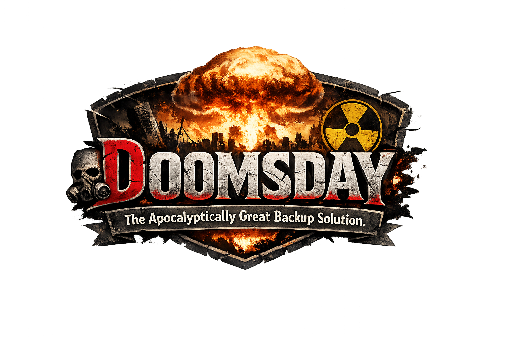

<p align="center">
  
</p>

<h1 align="center">Doomsday</h1>
<h3 align="center">Backup for the End of the World</h3>

<p align="center">
  <a href="https://github.com/jclement/doomsday/actions/workflows/ci.yml"></a>
  <a href="https://github.com/jclement/doomsday/releases/latest"></a>
  <a href="https://goreportcard.com/report/github.com/jclement/doomsday"></a>
  <a href="https://github.com/jclement/doomsday/blob/main/go.mod"></a>
</p>

<p align="center">
  An all-in-one, end-to-end encrypted backup solution.<br/>
  Single binary. Zero dependencies. Beautiful TUI. Can never lose data.
</p>

---

## Features

- **End-to-end encryption** -- AES-256-GCM with HKDF-derived sub-keys. The server never sees plaintext.
- **Content-defined chunking** -- FastCDC deduplication means only changed data moves over the wire after the first backup.
- **Multiple backends** -- Local filesystem, SFTP, and S3-compatible storage (Backblaze B2, MinIO, Wasabi, Cloudflare R2).
- **Single binary** -- `CGO_ENABLED=0` Go binary. Runs on Linux, macOS, and Windows. No runtime dependencies.
- **24-word recovery phrase** -- BIP39 mnemonic. 256 bits of entropy. If you lose this, your data is gone forever.
- **Built-in TUI** -- Interactive terminal UI for browsing snapshots, restoring files, and monitoring backup health.
- **SFTP server mode** -- Run Doomsday as a backup target with per-user quotas and append-only mode.
- **Flexible retention** -- Keep last N, hourly, daily, weekly, monthly, yearly policies per backup config.
- **Notifications** -- Command execution, webhooks, or email on backup failure. Escalation if no successful backup in N days.
- **Cron mode** -- `doomsday client cron install` generates systemd timers or launchd plists. No crontab editing.
- **Self-updating** -- `doomsday update` pulls the latest signed release.
- **Whimsy** -- Backup software doesn't have to be boring. (Disable with `whimsy = false` if you hate fun.)

## Installation

### Homebrew

```bash
brew install jclement/tap/doomsday
```

### Go

```bash
go install github.com/jclement/doomsday/cmd/doomsday@latest
```

### Docker

```bash
docker pull ghcr.io/jclement/doomsday:latest
```

### Binary releases

Grab a pre-built binary from [Releases](https://github.com/jclement/doomsday/releases). All checksums are signed with [cosign](https://github.com/sigstore/cosign).

## Quick Start

### 1. Initialize

Generate your master encryption key. Write down the 24-word recovery phrase. Guard it with your life.

```bash
doomsday client init
```

### 2. Configure

Create `~/.config/doomsday/client.yaml`:

```yaml
# ~/.config/doomsday/client.yaml

key: env:DOOMSDAY_PASSWORD   # or a literal passphrase

sources:
  - path: ~/Documents
  - path: ~/Projects
    exclude: [node_modules, .git, vendor]

exclude:
  - .cache
  - "*.tmp"
  - .Trash

schedule: hourly

retention:
  keep_last: 5
  keep_hourly: 24
  keep_daily: 7
  keep_weekly: 4
  keep_monthly: 12
  keep_yearly: -1

destinations:
  - name: nas
    type: sftp
    host: nas.local
    port: 2222
    user: backup
    ssh_key: "base64-ed25519-key"
    host_key: "SHA256:xxxx"
    schedule: 4h
    retention:
      keep_daily: 30

  - name: b2
    type: s3
    endpoint: s3.us-west-004.backblazeb2.com
    bucket: my-doomsday-backups
    key_id: env:DOOMSDAY_B2_KEY_ID
    secret_key: env:DOOMSDAY_B2_APP_KEY

settings:
  compression: zstd
  compression_level: 3
```

### 3. Backup

```bash
# Run a backup
doomsday client backup

# Verbose output
doomsday client backup --verbose
```

### 4. Browse & Restore

```bash
# List snapshots
doomsday client snapshots

# List files in a snapshot
doomsday client ls latest

# Find a file across snapshots
doomsday client find "taxes/2025*.pdf"

# Diff two snapshots
doomsday client diff abc123 def456

# Restore everything from the latest snapshot
doomsday client restore latest --target /tmp/restore

# Restore a specific path
doomsday client restore latest:Documents/taxes --target /tmp/taxes
```

### 5. Maintenance

```bash
# Verify backup integrity
doomsday client check

# Prune old snapshots per retention policy
doomsday client prune

# Show backup status and health
doomsday client status
```

## Secret Management

No secret ever needs to be stored in plaintext. Doomsday supports three resolution prefixes for any secret value in `client.yaml`:

| Prefix | Example | Description |
|--------|---------|-------------|
| `env:` | `env:DOOMSDAY_B2_KEY` | Read from environment variable |
| `file:` | `file:/run/secrets/key` | Read from file (Docker/K8s secrets) |
| `cmd:` | `cmd:op read "op://vault/item/field"` | Execute a command (1Password, `pass`, Keychain) |

Works great with secret managers:

```bash
# 1Password
op run --env-file=.env.doomsday -- doomsday client backup

# AWS Vault
aws-vault exec backup-role -- doomsday client backup

# Just export
export DOOMSDAY_PASSWORD="correct horse battery staple"
doomsday client restore latest --target /tmp/restore
```

## Cron Mode

```bash
# Install a systemd timer / launchd plist
doomsday client cron install

# Run scheduled backups (used by the installed timer)
doomsday client cron
```

Configure notifications so you know when things go wrong:

```yaml
notifications:
  policy: on_failure
  targets:
    - type: command
      command: "ntfy pub --title 'Doomsday backup failed' doomsday-alerts"
```

## Interactive TUI

Browse snapshots interactively:

```bash
doomsday client browse
```

Browse snapshots, restore files, monitor backup health, and manage keys -- all from an interactive terminal interface built with [Bubble Tea](https://github.com/charmbracelet/bubbletea).

## Server Mode

Run Doomsday as an SFTP backup target for other machines:

```bash
doomsday server serve
```

## JSON Output

Every command supports `--json` for scripting and automation:

```bash
doomsday client snapshots --json | jq '.snapshots[0].id'
doomsday client backup --json
doomsday client status --json
```

## Security

- AES-256-GCM encryption with HKDF-derived per-blob sub-keys
- HMAC-SHA256 content-addressed blob IDs (keyed -- no oracle attacks)
- scrypt key derivation (N=2^17, r=8, p=1) for password-based access
- BIP39 24-word recovery phrase (256 bits of entropy)
- All releases signed with [cosign](https://github.com/sigstore/cosign)
- CI runs `govulncheck` on every push

## License

MIT

---

<p align="center">
  <em>Vibe coded with Claude</em>
</p>
